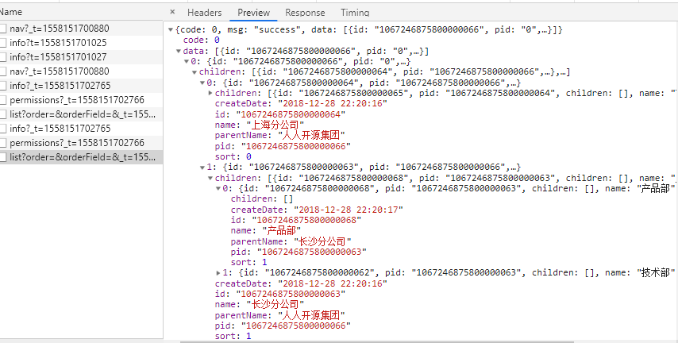

<!--
 * @Description: file content
 * @Author: huqi
 * @GitHub: https://github.com/hu-qi
 * @Email: me@huqi.me
 * @Date: 2019-05-18 10:57:34
 * @LastEditors: huqi
 * @LastEditTime: 2019-05-18 13:03:47
 -->

> Created by **[huqi](https://github.com/hu-qi)** at **2019-5-5 13:01:14**  
> Updated by **[huqi](https://github.com/hu-qi)** at **2019-5-5 13:01:14** 


↑开局一张图，故事全靠编↑

## 从最新学习d2开源项目说起
有时候，非常非常地迷茫，找不到方向，找不到人生的方向，找不到未来的方向，找不到学习的方向。现在的状态，犹如一叶扁舟，漂浮着茫茫的大海之上。工作日，每天起床机械地去上班，周末，每天优哉游哉，好像一个木偶，被生活蹂躏的木偶，意识以外的力量在操纵着的木偶。在技术上的积累也渐渐走下坡路了，基础不牢固，也采取过一些办法，不知是疗程不够还是病入膏肓已无可救药，总之，明明知道有病，却怎么也治不好。最近，又加入了[梁sir](https://github.com/LiangJunrong)的[暴走前端](https://github.com/LiangJunrong/document-library/blob/master/other-library/Monologue/GitHubRunawayRace.md)计划，重新折腾起来，于是开始学习，目前折腾了一下Vue.js，在看[d2](https://github.com/d2-projects)改版[renren](https://github.com/d2-projects/d2-admin-renren-security-enterprise)的项目,跟着@[FairyEver](https://github.com/FairyEver)大佬踩了不少坑,其中就有element-ui的这个坑--["Error: if there's nested data, rowKey is required."](https://github.com/ElemeFE/element/issues/14987)

## 刨根问到底，探究报错的原因
首先，不用怀疑，这是一个bug，理论上是element-ui中el-table的一个bug，但又不能说是一个bug，因为人家框架原型设计的就是这样，只是可能我们使用不当。先粗略分析一下报错的原因：
### 1. 没有加row-key属性
如文档中所提及的，结合报错的字面意思 ☞[文档:table](https://element.eleme.io/#/zh-CN/component/table)：

`
支持树类型的数据。此时，必须要指定 row-key。支持子节点数据异步加载。设置 Table 的 lazy 属性为 true 与 加载函数 load ，指定 row 中的 hasChildren 来确定哪些行是包含子节点。
`
那就copy一下官方案例，el-table加上row-key="id"
```js
 <el-table
    row-key="id"
 >
 </ el-table>
```
不过，对row-key的支持应该是2019年3月左右提供的。☞[Table: support tree structure data ](https://github.com/ElemeFE/element/pull/14632/commits)

### 修改element-ui版本
很气人啊，我只能修改package.json文件中依赖element-ui的版本。
一般来说，默认安装的依赖，如果package.json中带 **^** 符号的话，会默认安装最近的版本，去掉 **^** 符号，重新安装一下element-ui依赖就可以解决了。至于改用那个版本，按照实际来吧，如果去掉 **^** 符号重新安装能成功就可以了，不行就换个版本吧。

### 修改children字段
这个就不是很好的处理方式了，毕竟后台返回来的数据，你要他改字段，呵呵呵，当然，你话语权足够的话，又不想改前台代码，就让他替换一下childre字段吧。当然，官方将提供更改[children键值的api](https://github.com/ElemeFE/element/issues/14987#issuecomment-479809829)。
别问我children字段哪来的，我的是后台传过来的；   

也别问我为什么会冲突，
我猜是和之里冲突[☞源码](https://github.com/ElemeFE/element/blob/0e0a5061934bd1b5afed49b4d47baefdb9058959/packages/tree/src/model/node.js):
```js
  getChildren(forceInit = false) { // this is data
    if (this.level === 0) return this.data;
    const data = this.data;
    if (!data) return null;

    const props = this.store.props;
    let children = 'children';
    if (props) {
      children = props.children || 'children';
    }

    if (data[children] === undefined) {
      data[children] = null;
    }

    if (forceInit && !data[children]) {
      data[children] = [];
    }

    return data[children];
  }
```

至于怎么前台怎么修改children字段，我也不会，大概是深浅拷贝之类的操作吧

我最终通过修改element-ui版本和加row-key属性解决了，前端路漫漫坑多多，能趟一个算一个！

本小篇写于 **天河区图书馆华港分馆** ,第一次来图书馆看……小姐姐。

> <a rel="license" href="http://
creativecommons.org/licenses/by-nc-sa/4.0/"></a><br /><a xmlns:dct="http://purl.org/dc/terms/" property="dct:title">本作品</a> 由 <a xmlns:cc="http://creativecommons.org/ns#" href="https://github.com/hu-qi/Loner" property="cc:attributionName" rel="cc:attributionURL">Loner</a> 采用 <a rel="license" href="http://creativecommons.org/licenses/by-nc-sa/4.0/">知识共享 署名-非商业性使用-相同方式共享 4.0 国际 许可协议</a>进行许可。<br />基于<a xmlns:dct="http://purl.org/dc/terms/" href="https://github.com/hu-qi/Loner" rel="dct:source">https://github.om/hu-qi/Loner</a>上的作品创作。<br />本许可协议授权之外的使用权限可以从 <a xmlns:cc="http://creativecommons.org/ns#" href="https://creativecommons.org/licenses/by-nc-sa/2.5/cn/" rel="cc:morePermissions">https://creativecommons.org/licenses/by-nc-sa/2.5/cn/</a> 处获得。
