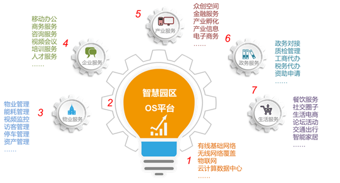
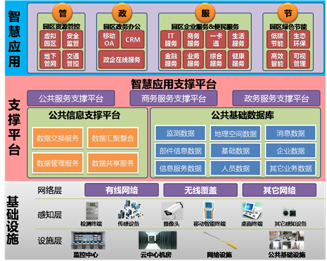
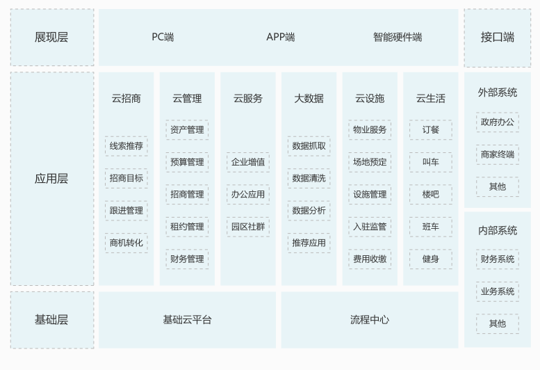
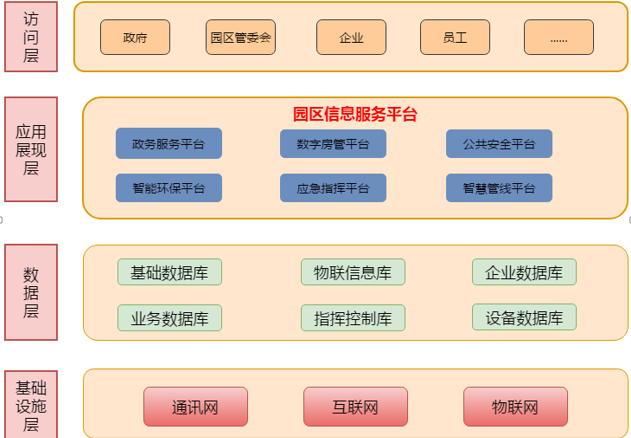

智慧园区解决方案(Smart Campus Solution)
===

> Created by **[huqi](https://github.com/hu-qi)** at **2019-5-7 16:23:32**  
> Updated by **[huqi](https://github.com/hu-qi)** at **2019-5-7 16:23:39** 

# 一、软通动力
>链接：http://www.isoftstone.com/sc/content.aspx?nodeid=151     

  

软通动力智慧园区包括基础设施层、平台层以及应用层，具体架构如下 

   
典型客户：高新科技园、文化创意园、创新创业园、电商产业园   

# 二、华为
> 链接：https://e.huawei.com/cn/solutions/industries/smart-campus   

华为智慧园区方案多达5种：智慧地产园区、智慧政府园区、智慧校园、智慧化工园区、通用园区功能场景。   

    

相关资料：华为智慧园区高层主打胶片 、华为敏捷园区网开放能力白皮书、华为敏捷园区解决方案 SAC智能应用控制技术白皮书、宣传彩页

# 三、京信通信
> 链接：http://www.comba.com.cn/Solution4-030102_3225.html    

 
# 四、阿里云
> 链接: https://cn.aliyun.com/solution/estate/smartpark2   

 
# 五、腾讯云
> 链接：https://cloud.tencent.com/solution/wisdom-park  

 

# 六、中科图新
> 链接：http://www.wish3d.com/solution/7.html   

 

# 七、左邻
> 链接：https://www.zuolin.com/jiejuefangan/yuanqu.html  

 

左邻的产出比较多如左邻APP、深圳科技园APP等
# 八、极策科技
> 链接：http://www.ex-mind.com/services/zhyq/   

 

#九、中海纪元
> 链接：http://www.zgcworld.com/zhuzhan/jjfa_zhyq/20160921/15.html   

 

---
> 广而告之：
> 游(云)泳(服)健(务)身(器)了解一下   
> [阿里云](https://promotion.aliyun.com/ntms/yunparter/invite.html?userCode=gpxmc5j3)   
> [腾讯云](https://cloud.tencent.com/redirect.php?redirect=1025&cps_key=f85209197b74eee56e03d8aa6c0db43d&from=console)

>  <a xmlns:dct="http://purl.org/dc/terms/" property="dct:title">本作品</a> 由 <a xmlns:cc="http://creativecommons.org/ns#" href="https://github.com/hu-qi/Loner" property="cc:attributionName" rel="cc:attributionURL">Loner</a> 采用 <a rel="license" href="http://creativecommons.org/licenses/by-nc-sa/4.0/">知识共享 署名-非商业性使用-相同方式共享 4.0 国际 许可协议</a>进行许可。 基于<a xmlns:dct="http://purl.org/dc/terms/" href="https://github.com/hu-qi/Loner" rel="dct:source">https://github.om/hu-qi/Loner</a>上的作品创作。 本许可协议授权之外的使用权限可以从 <a xmlns:cc="http://creativecommons.org/ns#" href="https://creativecommons.org/licenses/by-nc-sa/2.5/cn/" rel="cc:morePermissions">https://creativecommons.org/licenses/by-nc-sa/2.5/cn/</a> 处获得。

